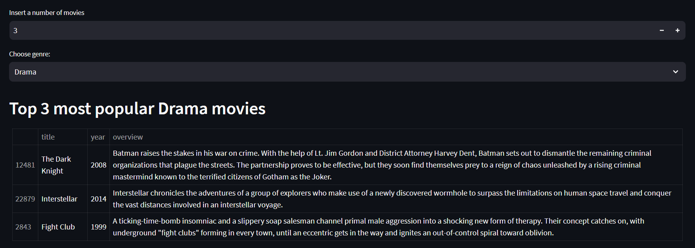
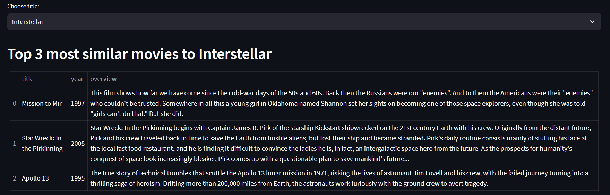

# Система Рекомендаций Фильмов

Это система рекомендаций фильмов, реализованная на Python с использованием библиотеки Streamlit. Датасет для обучения взят с Kaggle - [The Movies Dataset](https://www.kaggle.com/datasets/rounakbanik/the-movies-dataset). Система предоставляет два вида рекомендаций:

1. **Рекомендации Топ-N**: Предоставляет рекомендации на основе популярных фильмов в выбранном жанре - рекомендует N наиболее популярных фильмов в выбранном жанре.
   


3. **Рекомендации на основе NLP (Content Based)**: Предоставляет рекомендации на основе схожести фильмов с использованием техник обработки естественного языка (NLP) - рекомендует N фильмов, наиболее схожих с заданным фильмом.
   


## Основные спользованные библиотеки

- [scikit-learn](https://github.com/scikit-learn/scikit-learn)
- [streamlit](https://github.com/streamlit/streamlit)
- [nltk](https://github.com/nltk/nltk)

## Установка

1. Клонируйте данный репозиторий:

```bash
git clone https://github.com/your-username/movie-recommendation-system.git
cd movie-recommendation-system
```

2. Установите необходимые пакеты:
```bash
pip install -r requirements.txt
```

3. Запустите приложение Streamlit
```bash
streamlit run app.py
```
Веб-приложение запустится в вашем браузере. Вы можете выбрать количество рекомендаций, жанр и заголовок фильма, чтобы получить персонализированные предложения по фильмам.


